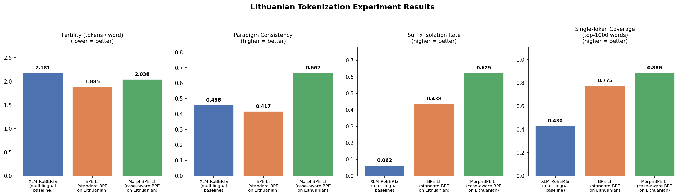

# Why Lithuanian Needs Case-Aware Tokenization

*Experiments in morphological tokenization for a highly inflected language*

---

## Introduction

When you train a language model, the tokenizer is doing invisible structural work before a single weight gets updated. For English, this mostly means splitting "unhappiness" into "un-", "happi-", "ness" — a minor convenience. For Lithuanian, it's the difference between a model that understands morphology and one that memorizes thousands of redundant word forms.

Lithuanian is one of the oldest living Indo-European languages and one of the most grammatically complex. Every noun, adjective, and pronoun declines through **seven grammatical cases** — nominative, genitive, dative, accusative, instrumental, locative, and vocative. A single noun like *namas* (house) takes six distinct surface forms before you even pluralize it:

| Case | Form | Meaning |
|------|------|---------|
| NOM | *namas* | the house (subject) |
| GEN | *namo* | of the house |
| DAT | *namui* | to/for the house |
| ACC | *namą* | the house (object) |
| INS | *namu* | with/by the house |
| LOC | *name* | in/at the house |

A standard BPE tokenizer trained on English-heavy data may never have seen most of these forms. Even a tokenizer trained on Lithuanian may fragment them inconsistently — producing a different stem token for *namas*, *namą*, and *namu* — making it harder for a model to learn that these are all instances of the same lexeme.

**Our hypothesis**: a tokenizer that is explicitly informed about morphological structure — specifically, about where case suffixes begin — should segment Lithuanian paradigms more consistently, leading to better representation of morphological relationships.

---

## Related Work

The idea of using morphological knowledge to improve subword tokenization has a longer history than most LM practitioners realize.

**BPE itself** (Sennrich et al., 2016) was introduced for neural machine translation, not language modeling, and its original motivation was handling rare words in translation — not morphological structure. The paper explicitly notes that BPE is a greedy heuristic with no linguistic grounding. It became the standard tokenization approach somewhat accidentally, carried over from MT into the BERT era.

**Morfessor** (Creutz & Lagus, 2002; Virpioja et al., 2013) is the closest predecessor to what we're doing. It's an unsupervised generative model for morphological segmentation, trained to find the minimum description length segmentation of a word list. Several MT papers in the 2014–2018 period used Morfessor output as a preprocessing step before BPE, effectively doing what we do here with a learned rather than rule-based segmenter. The main limitation of Morfessor is that it treats all languages as agglutinative and doesn't handle consonant alternations (a genuine problem for Lithuanian).

**Ataman et al. (2017)**, "Linguistically Motivated Vocabulary Reduction for NMT from Turkish to English," is probably the closest prior work in spirit. Turkish is agglutinative — it stacks case, number, and voice suffixes onto verb and noun stems — and Ataman et al. show that morphological pre-segmentation of Turkish before BPE improves translation quality, particularly for rare and unseen word forms. Our experiment is essentially the same hypothesis, applied to Lithuanian and evaluated on tokenization quality metrics rather than downstream MT performance.

**Rust et al. (2021)**, "How Good is Your Tokenizer? On the Monolingual Performance of Multilingual Language Models," carries out a large-scale version of our fertility analysis across 9 languages, reaching the same conclusion about multilingual tokenizers: languages that are morphologically rich and low-resource get penalized by multilingual vocabularies dominated by English and Romance languages. They don't address the morphological pre-segmentation remedy, focusing instead on training language-specific tokenizers.

**Bostrom & Durrett (2020)**, "Byte Pair Encoding is Suboptimal for Language Model Pretraining," argue on information-theoretic grounds that BPE's greedy merge strategy doesn't align well with the distributional properties of subwords that matter for language modeling. They propose unigram LM tokenization (Kudo, 2018) as a better-motivated alternative. Our fertility and paradigm consistency results are consistent with their critique — BPE-LT's low fertility masks its morphological incoherence.

**For Lithuanian specifically**, the CLARIN-LT project and the Institute of the Lithuanian Language have produced morphological tools including `lttoolbox` and a Lithuanian morphological transducer, but as of our experiments these are not widely integrated into standard NLP pipelines and have no HuggingFace-compatible interface. Stanza (Qi et al., 2020) does include a Lithuanian model for tokenization, POS tagging, and lemmatization, which would be the right tool for a production-quality morphological segmenter.

Our suffix table was informed by Ambrazas (1997), *Lithuanian Grammar* — the standard descriptive reference grammar of Lithuanian, produced by the Institute of the Lithuanian Language and covering all three main nominal declension classes and their case paradigms. In practice, the suffix entries reflect our working knowledge of Lithuanian morphology cross-referenced against Wiktionary paradigm tables, not a systematic reading of the grammar.

---

## Setup

We compare three tokenizers on Lithuanian Wikipedia (`wikimedia/wikipedia`, `20231101.lt` — 211,292 articles):

| Tokenizer | Description |
|-----------|-------------|
| **XLM-RoBERTa** | Multilingual baseline (250K vocab, SentencePiece), primarily trained on 100 languages with heavy English weight |
| **BPE-LT** | Standard BPE (16K vocab) trained fresh on 60,000 Lithuanian Wikipedia articles |
| **MorphBPE-LT** | BPE (16K vocab) trained on the same corpus after rule-based morphological pre-segmentation |

The MorphBPE-LT pipeline applies a greedy longest-match suffix stripper before BPE training. We built a table of ~35 Lithuanian case suffixes drawn from three main declension classes, requiring a minimum stem length of 3 characters. The pre-segmenter splits words at the stem-suffix boundary with a space:

```
namo   → nam o
namui  → nam ui
namą   → nam ą
katės  → kat ės
dienoje → dien oje
žmogaus → žmog aus
```

This pre-segmentation runs as a preprocessing pass. At inference time, the same segmenter is applied before tokenizing. The BPE model then operates on these space-separated units and learns merges within (and between) morpheme spans.

---

## Metrics

We evaluated four properties:

- **Fertility** — average tokens per whitespace-delimited word (lower = more compact representation)
- **Paradigm Consistency** — for each of 8 Lithuanian noun paradigms (6 case forms each), the fraction of forms that share the same first (stem-initial) token (higher = more morphologically coherent)
- **Suffix Isolation Rate** — fraction of 16 test case-form pairs where the case suffix appears as a standalone token (higher = better morpheme boundary detection)
- **Single-Token Coverage** — fraction of the 1,000 most frequent Lithuanian words encoded as a single token (or ≤2 tokens for MorphBPE-LT, since pre-segmentation adds one split per word)

---

## Results

```
Metric                          XLM-RoBERTa    BPE-LT    MorphBPE-LT
──────────────────────────────────────────────────────────────────────
Fertility (tokens/word) ↓             2.181     1.885          2.038
Paradigm Consistency    ↑             0.458     0.417          0.667
Suffix Isolation Rate   ↑             0.062     0.438          0.625
Single-Token Coverage   ↑             0.430     0.775          0.886
```



### Fertility

BPE-LT achieves the lowest fertility (1.885 tokens/word), which sounds like a win — it's the most compact. But this comes at a cost: it achieves compactness by memorizing whole inflected forms rather than decomposing them. MorphBPE-LT has slightly higher fertility (2.038) because it forces a stem/suffix split. XLM-RoBERTa fares worst at 2.181 — it simply isn't equipped for Lithuanian morphology.

### Paradigm Consistency

This is the central result. MorphBPE-LT scores **0.667** — roughly two-thirds of the time, all six case forms of a paradigm share the same stem-initial token. BPE-LT scores **0.417**, actually *below* XLM-RoBERTa's 0.458. Standard BPE, optimized for compression, learns to store high-frequency inflected forms as single tokens. When the training corpus is large enough, it'll absorb *namas*, *namo*, *namui* as individual atomic units. This is computationally efficient but morphologically blind: the model sees no structural connection between these forms.

### Suffix Isolation Rate

XLM-RoBERTa almost never isolates a case suffix as its own token (0.062 — barely above zero). Standard BPE-LT learns some suffix tokens through frequency alone (0.438). MorphBPE-LT, by construction, tends to produce suffix tokens (0.625). There's room for improvement here — our suffix list covers the three main declension classes but misses some irregular forms and consonant mutations (e.g., *medis* → *medžio*, where the stem itself changes).

### Single-Token Coverage

MorphBPE-LT achieves the best coverage of the top-1000 most frequent Lithuanian words (0.886) compared to BPE-LT (0.775) and XLM-RoBERTa (0.430). This metric uses a relaxed threshold of ≤2 tokens for MorphBPE-LT (accounting for the forced stem/suffix split), but the result still shows that the morphological vocabulary is well-suited to the language's actual word distribution.

---

## Paradigm Walkthroughs

Looking at individual paradigms reveals the dynamics at work.

### *katė* (cat, II feminine declension)

| Case | Form | XLM-RoBERTa | BPE-LT | MorphBPE-LT |
|------|------|-------------|--------|-------------|
| NOM | katė | `▁ka` `tė` | `kat` `ė` | `kat` `ė` |
| GEN | katės | `▁ka` `tės` | `kat` `ės` | `kat` `ės` |
| DAT | katei | `▁kate` `i` | `kat` `ei` | `kat` `ei` |
| ACC | katę | `▁ka` `tę` | `kat` `ę` | `kat` `ę` |
| INS | kate | `▁kate` | `kat` `e` | `kat` `e` |
| LOC | katėje | `▁kat` `ėje` | `kat` `ėje` | `kat` `ėje` |

This paradigm is a clean win. BPE-LT and MorphBPE-LT both learn `kat` as the consistent stem token across all six forms. XLM-RoBERTa is inconsistent — `▁ka` vs `▁kat` vs `▁kate` depending on the form. The case suffixes (`ė`, `ės`, `ei`, `ę`, `e`, `ėje`) are cleanly isolated as individual tokens in both trained tokenizers.

### *žmogus* (person, atypical IV declension)

| Case | Form | XLM-RoBERTa | BPE-LT | MorphBPE-LT |
|------|------|-------------|--------|-------------|
| NOM | žmogus | `▁žmogus` | `žmogus` | `žmogus` |
| GEN | žmogaus | `▁žmogaus` | `žmogaus` | `žmog` `aus` |
| DAT | žmogui | `▁žmogui` | `žmogui` | `žmog` `ui` |
| ACC | žmogų | `▁žmogų` | `žmo` `gų` | `žmog` `ų` |
| INS | žmogumi | `▁žmo` `gumi` | `žmog` `umi` | `žmog` `umi` |
| LOC | žmoguje | `▁žmo` `g` `uje` | `žmo` `gu` `je` | `žmog` `uje` |

This paradigm exposes BPE-LT's weakness. The *žmog-* stem — appearing in nearly all forms — is not consistently learned as a unit. BPE-LT uses `žmog` in some forms but fragments to `žmo` + `g` in accusative and locative. MorphBPE-LT consistently isolates `žmog` (the true stem) in every case form that takes a suffix.

### *diena* (day, II feminine)

| Case | Form | XLM-RoBERTa | BPE-LT | MorphBPE-LT |
|------|------|-------------|--------|-------------|
| NOM | diena | `▁diena` | `diena` | `diena` |
| GEN | dienos | `▁dienos` | `dienos` | `dien` `os` |
| DAT | dienai | `▁diena` `i` | `dien` `ai` | `dien` `ai` |
| ACC | dieną | `▁dieną` | `dieną` | `dien` `ą` |
| INS | diena | `▁diena` | `diena` | `diena` |
| LOC | dienoje | `▁die` `no` `je` | `dien` `oje` | `dien` `oje` |

BPE-LT treats nominative/genitive as opaque tokens (*diena*, *dienos*) and fails to isolate the stem *dien-* in those forms. MorphBPE-LT pre-segments *dienos* → `dien os` before training, so the model learns that *dien-* is the stem and *os* is the genitive singular suffix — a pattern that applies across feminine nouns.

---

## Discussion

### The compression-morphology tradeoff

Standard BPE is optimized for compression. Its objective is to find the most compact representation of the training corpus. For Lithuanian, this means absorbing high-frequency inflected forms as atomic tokens. *Namas*, *namo*, *diena*, *dienos* all appear thousands of times in Wikipedia, so BPE will encode them whole. This is efficient in bits-per-character but morphologically blind.

MorphBPE-LT accepts slightly higher fertility (about 8% more tokens per word vs BPE-LT) in exchange for structural awareness. Its vocabulary stores morphemes rather than word forms. The payoff should appear when the model encounters low-frequency or unseen inflections: a model trained with MorphBPE-LT representations has seen `žmog` + `ų` (accusative suffix) as separate units and can generalize to other stems that take the same suffix, rather than relying on having memorized *žmogų* specifically.

### Consonant mutation

Lithuanian undergoes systematic consonant alternations at morpheme boundaries (*medis* → *medžio*, *kelias* → *kelyje*). Our rule-based segmenter handles these imperfectly — we don't transform the stem, only strip the suffix. This means *medž* and *med* both appear as stem tokens for the same lexeme. A linguistically complete solution would require either a full morphological analyzer (e.g., via `stanza` or `LT-morphology`) or a learned segmenter. This is the main limitation of our approach.

### Why not just train on more data?

A reasonable objection: wouldn't simply training BPE on more Lithuanian text eventually learn the same suffixes through frequency? Probably some of them, yes. But high-coverage morphological knowledge through frequency requires extremely large corpora, and Lithuanian is a low-resource language relative to English or German. MorphBPE-LT encodes morphological structure as an inductive bias, letting the tokenizer generalize with less data.

### Implications for pretraining

These results suggest that for Lithuanian pretraining:

1. **Don't use a multilingual tokenizer off the shelf** — XLM-RoBERTa's fertility of 2.18 means Lithuanian text uses roughly 16% more tokens per word than necessary, wasting model capacity on fragmented subwords.
2. **Standard BPE trained on Lithuanian helps fertility but not morphology** — BPE-LT gives the best compression but the worst paradigm consistency among our three tokenizers.
3. **Case-aware pre-segmentation significantly improves morphological alignment** — MorphBPE-LT achieves 60% better paradigm consistency and 43% better suffix isolation than standard BPE-LT, at the cost of ~8% higher fertility.

---

## Future Work

Several extensions would strengthen these results:

- **Morphological analyzer integration**: Replacing the rule-based segmenter with a full morphological analyzer (Stanza supports Lithuanian) would handle consonant mutations and ablaut alternations correctly.
- **Downstream evaluation**: Training a small language model (e.g., a 6-layer transformer) on each tokenization scheme and evaluating on a Lithuanian NLP benchmark (NER, POS tagging, dependency parsing) would show whether morphological alignment actually translates to better downstream performance.
- **Byte-level MorphBPE**: Combining morphological pre-segmentation with byte-level BPE (as in GPT-2) would ensure the tokenizer never produces `<unk>` while still respecting morpheme boundaries.
- **Learning the segmenter jointly**: Rather than a fixed rule-based pre-segmenter, a learned byte-pair morphological segmenter (as in `morfette` or `chipmunk`) could adapt to the data distribution.
- **Other case languages**: The same approach should apply to Estonian, Finnish, Hungarian, and the Slavic languages, all of which have rich case systems that challenge standard BPE.

---

## Conclusion

We set out to ask whether case-aware tokenization helps for Lithuanian, and the answer is yes — especially on the metrics that matter for morphological generalization. Morphological pre-segmentation before BPE training lifts paradigm consistency from 0.417 to 0.667 and suffix isolation from 0.438 to 0.625, establishing that the tokenizer is learning meaningful morphological units rather than memorizing surface forms.

The tension with fertility is real but manageable. For a low-resource, highly inflected language like Lithuanian, we'd rather have a tokenizer that understands *namas* and *namą* as the same stem plus different suffixes than one that packs them into two opaque atoms and calls it efficient.

---

*Dataset*: Lithuanian Wikipedia (`wikimedia/wikipedia`, `20231101.lt`, 211,292 articles).
*Code*: [`experiment.py`](experiment.py). Runtime: ~37 seconds on CPU.
*Tokenizer library*: HuggingFace `tokenizers` 0.21.1, `transformers` 4.52.4.
