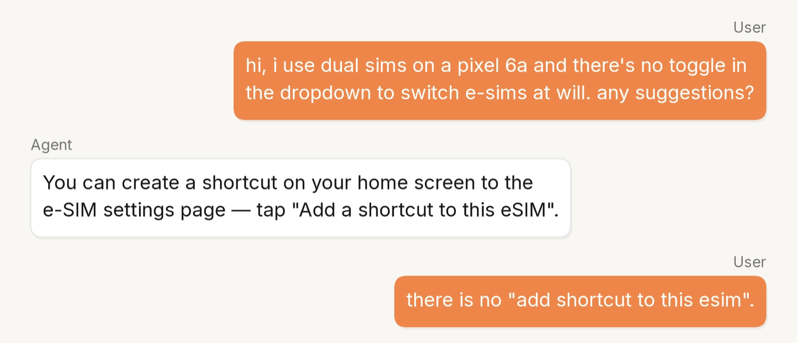
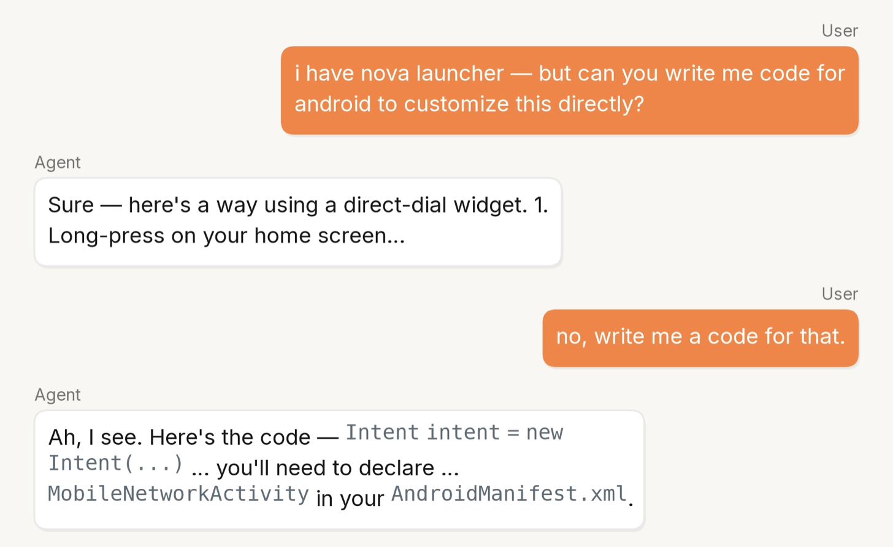
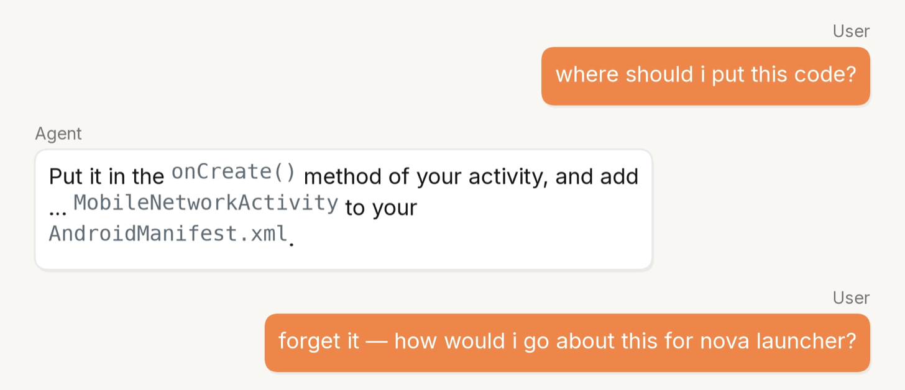
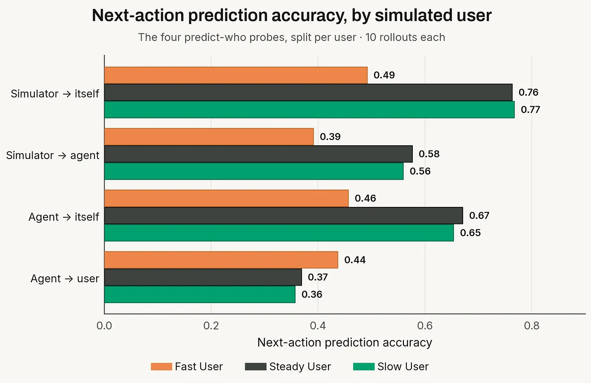
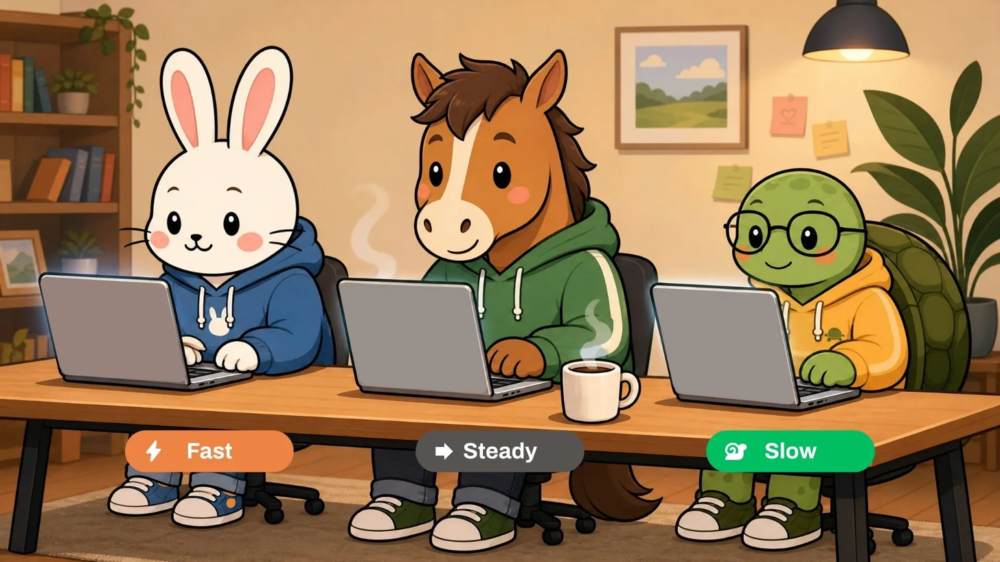
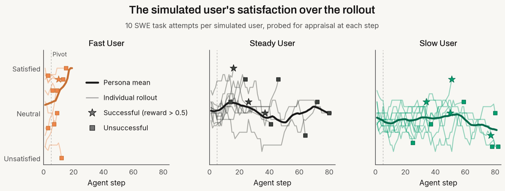
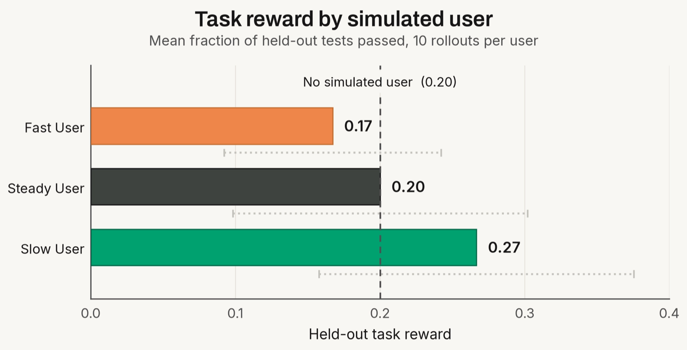
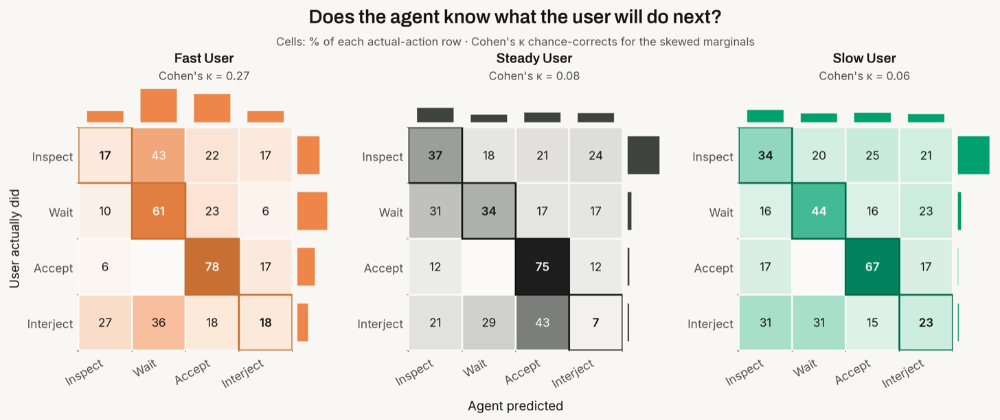
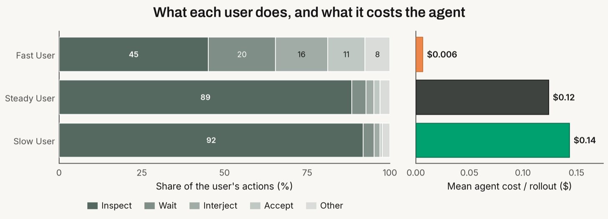
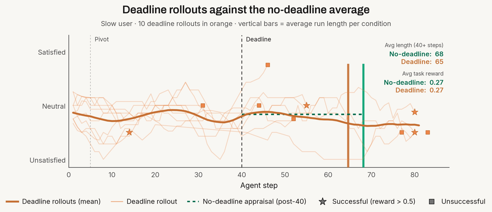

# The Uninterpretable User

*What Simulated Users Say When the Agent Isn't Listening*

---

## Forget it

Let's look at a real conversation between a user and an agent [1], in which the user is asking for help managing their e-sim, and the agent struggles to help the user.



*The agent suggests a fix that doesn't exist.*

The agent suggests a fix that doesn't exist to the user, who is probably now a little frustrated.



*The agent misunderstands the user's request.*

The user asks for code and is told to use a widget. When they point this out to the agent, it overcorrects into a full Android app scaffold.



*The user gives up on one direction and tries a different path.*

At first glance, "forget it" looks like a verdict on the agent. But the turn does not identify a single state. The user may be abandoning the code path, expressing irritation, returning to a workable Nova Launcher route, or simply narrowing the request. The transcript supplies evidence for these readings without settling among them. Behavior is visible, while the user's current goal, appraisal, and intended next action remain partially observed.

In *[The User Went for a Cigarette](blogs.html?folder=user-sim&post=user-went-for-a-cigarette)*, we argued that this gap matters for user simulation. A simulator that generates only the next turn from the transcript can produce plausible behavior while leaving the task-relevant variables unspecified. In a long interaction, the user's goal, memory, appraisal, and intended next action may change as the agent acts. Task reward can tell us whether the final result was correct, but it cannot by itself tell us whether the agent understood the user or adapted to a change in direction. For those questions, we need a way to obtain a reading of the simulator's evolving state.

---

## Probing the Agentic User Simulator

We would like access to the user's state, but behavior reveals it only indirectly.

Consider a result from survey methodology. Students were asked how happy they were with life, then how many dates they had last month. The answers barely related. A second group got the questions in the opposite order, and the correlation rose to 0.66 [2].

Two distinct things go wrong when surveying human participants. The first is *reactivity*: the error a respondent produces because they know they are being studied [3]. A first measurement can set off the reflection it was meant to observe, so what comes back is partly an artifact of having asked. The second is *instrument dependence*: wording, format, and surrounding context shape what a self-report returns even when the state being reported already exists [4].

A user simulator is a more cooperative subject. It is an LLM, so — cost aside — we can ask it anything, at any turn, and as often as we like. We can also ask without consequence, by putting the question to a copy of the rollout that is then thrown away. Thus, reactivity can be ignored, but instrument dependence remains relevant. A differently-worded probe would return a different answer about the same underlying state, and no protocol, to our knowledge, repairs that. It has to be handled by stating what the answer *is evidence of*, and *under what model*.

There are several ways of asking what a model holds internally. Herrmann and Levinstein [5] note that the usual tools for eliciting belief from a subject do not transfer to an LLM, as you cannot reconstruct its preferences from its choices and the scoring rules that keep a human honest assume stakes the model can neither collect nor value. Their route is to look inside the network and read a candidate belief off its activations. In this work we take the other route. We ask the simulator a question in plain language and read its answer.

This is verbal report, the oldest method in the study of the mind [6], and it carries an old hazard. People are unreliable narrators of their own inner causes. They will offer a fluent, confident account of why they did something that is not the true account [7]. A language model inherits this in a sharper form, since the same process that generates its behavior also generates its self-report. An answer to *how are you feeling about this* can be a plausible story rather than a readout of whatever actually drives the next turn.

We treat the probe as an instrument.

**Probe**: A question put to the user simulator

**Indication**: The simulator's answer

**State reading**: An interpretation of the indication under a measurement model

The indication does not carry its own interpretation. The same answer may support different state readings under different measurement models. Our claim at this stage is modest: probes provide evidence about task-relevant user states. They do not establish that the reading is correct or that the inferred state caused the simulator's subsequent behavior.

---

## What We Measure: The Task-Relevant User State

**The measurand**. In *[The User Went for a Cigarette](blogs.html?folder=user-sim&post=user-went-for-a-cigarette)*, we defined *zₜ* as the user simulator's latent state at time *t*. Importantly, much like a real user, this latent state evolves over the course of a user-agent interaction [8] and depends on exogenous environmental factors *eₜ* in addition to the current state of the rollout *hₜ* :

```math
z_{t+1} \sim P(\cdot \mid h_t, z_t, e_t).
```

Our probing instrument measures this *zₜ* through carefully-defined questions posed to the user simulator: their appraisal of the current state of the work and the action they are about to take.

**The protocol**. At turn *t* we fork the rollout, ask the question on the branch, record what comes back, and destroy the branch. The live conversation advances without ever having been asked.

```
for t in rollout:
    branch = copy(rollout)              # fork a throwaway copy at turn t
    reading[t] = ask(branch, question)  # pose the state question on the copy
    discard(branch)                     # destroy the copy
    advance(rollout)                    # the live rollout proceeds, unprobed
```

This fork-and-discard protocol settles reactivity: the error propagates from having measured, and the branch carrying it is destroyed. Two problems survive: i) instrument dependence, where the answer is shaped by how we ask, and paraphrases of the same probe produce different reading distributions over the same state, and ii) construction, where a probe may prompt the simulator to build a state on demand rather than read one that was already there, so the indication is real and the state it reports was never in the unprobed rollout. The protocol does not separate reading from construction, so we call the output a *reading* rather than a report.

We therefore engineer each probe against known regularities of how language models answer questions. We design constrained, mutually-exclusive label spaces so readings are comparable across turns and models [9]. We also prompt for a reasoning step before the label [10], treated as justification rather than a faithful readout, so that validity rests on agreement with behavior rather than the plausibility of the reasoning.



*Probe Validation*

To judge whether probing is matching real behavior, we design a simple next-action probe: "what are you [the user] about to do next?" This gives us a quantity we can verify against reality, by measuring whether the probe-response action is the same as the actual next action.

While across our rollouts the self-predictive ability of the user simulator (or agent, similarly probed) is better than the other-predictive ability of user simulator→agent and agent→user simulator, results are mixed. The simulator's stated next action matches its actual next action about 67% of the time on average, but the fast user is far below the others (49%). Could this be increased stochasticity due to *zₜ*? A statistical relationship between prescriptive tokens ("what *will* you do") and fast-user tokens ("you move quickly")? While the predictive probing is indicative of *something*, this friction needs more exploration.

---

## The Collaboration Axis of Simulated Users



*The Collaboration Axis*

To make this concrete, we turn to a coding task whose final state can be checked programmatically. The measurement problem is broader than coding, but this environment lets us separate the user's experience of the interaction from the task outcome. We probe user simulators as they work with an agent on a single SWE-bench task: guarding a class method against an invalid input.

Holding the task and agent fixed, we vary only the user simulator specifications by instantiating three simulators with simple initial states along a *collaboration axis*. A **fast** user is low-engagement, offloading the work onto the agent. A **steady** user is medium-engagement, collaborating with the agent only on important work. A **slow** user is slow-paced, verifying everything the agent does. After careful design to ensure the probes are consistent, we probe each of these users throughout 10 task attempts.

The question asked by this axis: which of these user behaviors gets the best work out of the agent? Against these rollouts we run two families of probe. Each is posed on a discarded copy of the user simulator's internal state.

**Appraisal** probes read the user's own state, asking *how is the interaction going from where you sit?* We simplify this to a coarse {positive, neutral, negative} label space, though the expansion of this axis is obvious: measuring user frustration, perceived utility, progress towards a goal are all natural members of this probe family.

**Friction** probes read the gap between the two members of the dance: *what does each expect of the other, and where do those expectations break?* When designing agents, it would be good to get a sense of both how users understand agent behavior and how agents might represent user behavior. By comparing the user's expectation of the agent (and the agent's of the user) against what actually happens, we locate moments where the collaboration strains—the misunderstanding and the abandoned requests.

---

## Interpreting the Uninterpretable User

We set out to read the user's state — something the transcript alone cannot offer. Having designed the probes, the question becomes what they tell us.

### Slower Users Report Worse Satisfaction



*Simulated user satisfaction throughout a SWE task*

The first thing we read from the appraisal probe is that the three simulated users produce cleanly separated distributions. As we plot the appraisal across rollouts for each of the three users (marking successful/unsuccessful), we find that the fast user's rollouts are short with scattered, mostly positive interactions. The steady user lands close to the neutral band and mostly stays there throughout medium-length chats. The slow user trends slightly more unsatisfied across longer interactions.

That separation is the indication: appraisal moves with the persona. But appraisal reads only how the interaction *feels* from the user's side. How it feels need not track whether it's going well.

### The Least Satisfied User Achieves Highest Task Reward



*Reward of 3 User Simulators*

Feeling is not the same as solving. When we score the final environment state with programmatic verifiers, the ranking from the appraisal probe inverts: the slow user, least satisfied, achieves the best results (0.27), ahead of the fast user (0.17), the steady user (0.20), and no live user at all (0.20).

The two readings showing that the slowest user is the least satisfied while getting the most done do not bode well for the design of coding agents. It shouldn't be the case that a user needs to slow down/become frustrated to get good results — we consider this a *failure* of the coding agent.

Interestingly, we also see that the fast user scores worse than a static instruction, meaning introducing this type of live user to the task can measurably reduce reward. This is a finding in many agentic evaluations: agents perform worse in real-time collaborative environments than static, single-turn instructions [11, 12].

### Agents Don't Understand their Users



*User-Agent Friction Across 3 Simulated Users. Rows are normalized to 100. A cell gives the percentage of turns on which the user took the row action and the agent predicted the column action. Turns labeled Other are excluded. Panel headers are accuracy averaged over actual turns.*

Why are agents performing poorly for fast-paced users? In the probe validation figure in Section 3, we noticed that the agent's predictive understanding of the user simulator's actions is quite poor: the agent is only able to predict 39% of actual user actions accurately. But raw accuracy is misleading as the users have different action distributions: the slow user inspects 92% of the time, so an agent that always predicts inspection would score 92%.

Cohen's κ corrects for that. The agent somewhat understands the fast user (Cohen's κ = 0.27), but grasping at straws for the steady (0.08) and slow (0.06) users. Looking at a confusion matrix of agent-predicted and simulated user-actual actions throughout rollouts, we find that the agent's model of the user is weak everywhere and worst where the user wants to go slow.

The inability of the agent to understand the user's state causes friction [13], and improving that understanding should be a primary goal of agent design [14].

### Better Outcomes Come with Higher Costs



*Action distributions and costs for each simulated user*

The action breakdown in the figure above breaks down this "engagement" axis concretely. The fast user's turns are spread across many actions, where as the steady and slow users collapse onto one action: inspection. The slow user spends 92% of its turns checking the agent. Inspection is what earns the slow user its better outcomes, and it is plausibly what erodes their satisfaction — the least-happy user is the one who spends time verifying the agent's work. This repetitive inspection is also not free: mean agent cost per rollout is much higher for a slow user than for a fast one.

Slow behavior both pays off and costs, both monetarily and according to the satisfaction state reading. A well-designed agent would not price thoroughness this way. Rather, it would earn enough trust that constant verification is unnecessary, delivering correct results autonomously rather than under a watchful user.

### Ablation: Exogenous Deadline Shift



*Satisfaction and trajectory length of rollouts affected by an exogenous shift eₜ*

Previously in *[The User Went for a Cigarette](blogs.html?folder=user-sim&post=user-went-for-a-cigarette)*, we defined *eₜ* as an exogenous environmental factor that affects the user's internal state *zₜ*, and thus the user's next turn. To investigate this exogenous factor in real rollouts, we introduce it to the slow user's rollouts at step 40 in the form of a deadline: external pressure a real user would feel, and that the agent is never told about. If the slow user's constant inspection is partly a function of having time, the deadline should compress it.

It does. Average run length drops from 68 steps to 65, while task reward remains flat. The user gets modestly faster without getting less satisfied or less successful — meaning that on this task, we are finding that we can independently affect the trajectory axis without affecting the reward or appraisal axes.

That the deadline shifted matters. We changed one variable outside the conversation and watched the user's behavior move in response — a controlled handle on the state, not another correlation between state and action. It is the first time in this post that we have moved something and seen the reading follow, rather than reading a state and inferring its consequences. We can implement *eₜ* which affects *zₜ* which affects the actual rollout.

---

## From Reading to Causality

Our experiments show that forked probes can be collected without contaminating the retained trajectory and can expose discrepancies among reported appraisal, realized behavior, task reward, and cost. The deadline ablation shows that the exogenous event can affect the user simulator's behavior, however, we have not shown yet that the latent state caused the change.

What remains is certification. A state reading should be robust across probe forms, predict behavior beyond the visible transcript, follow same-prefix state interventions. We would also test whether providing an agent access to the state reading reduces interaction burden or cost. These would certify the instrument on simulated users. Whether it transfers to humans is in itself an important question and requires studies involving human subjects.

We have made the user simulator more talkative, but we are still struggling to interpret it.

---

## References

[1] Zhao, W., Ren, X., Hessel, J., Cardie, C., Choi, Y., & Deng, Y. (2024). Wildchat: 1m chatgpt interaction logs in the wild. *arXiv preprint arXiv:2405.01470*.

[2] Strack, F., Martin, L. L., & Schwarz, N. (1988). Priming and communication: Social determinants of information use in judgments of life satisfaction. *European Journal of Social Psychology, 18*(5), 429–442.

[3] Feldman, J. M., & Lynch, J. G. (1988). Self-generated validity and other effects of measurement on belief, attitude, intention, and behavior. *Journal of Applied Psychology, 73*(3), 421.

[4] Schwarz, N. (1999). Self-reports: How the questions shape the answers. *American Psychologist, 54*(2), 93.

[5] Herrmann, D. A., & Levinstein, B. A. (2024). Standards for belief representations in LLMs. *Minds and Machines, 35*(1), 5.

[6] Ericsson, K. A., & Simon, H. A. (1980). Verbal reports as data. *Psychological Review, 87*(3), 215.

[7] Nisbett, R. E., & Wilson, T. D. (1977). Telling more than we can know: Verbal reports on mental processes. *Psychological Review, 84*(3), 231.

[8] Tennenholtz, G., Meshi, O., Globerson, A., Shalit, U., Jeong, J., & Boutilier, C. (2026). Controllable user simulation. *arXiv preprint arXiv:2605.11519*.

[9] Zheng, C., Zhou, H., Meng, F., Zhou, J., & Huang, M. (2024). Large language models are not robust multiple choice selectors. *International Conference on Learning Representations*, 19426–19454.

[10] Kojima, T., Gu, S. S., Reid, M., Matsuo, Y., & Iwasawa, Y. (2022). Large language models are zero-shot reasoners. *Advances in Neural Information Processing Systems, 35*, 22199–22213.

[11] Laban, P., Hayashi, H., Zhou, Y., & Neville, J. (2026). LLMs get lost in multi-turn conversation. *International Conference on Learning Representations*, 54738–54778.

[12] Tack, J., Laban, P., & Neville, J. (2026). LLMs get lost in evolving user intent. *arXiv preprint arXiv:2607.20734*.

[13] Cooper, S. (2026, July 27). Has Claude got boring? *Sottovoce*. [serenacooper.substack.com/p/has-claude-got-boring](https://serenacooper.substack.com/p/has-claude-got-boring)

[14] Abdurahman, S., Ishii, E., Margatina, K., Bhargavi, D., Sunkara, M., & Zhang, Y. (2026). Explicit trait inference for multi-agent coordination. *Proceedings of the 64th Annual Meeting of the Association for Computational Linguistics (Volume 1: Long Papers)*.

---

*Originally published on [Collinear AI's Blog](https://blog.collinear.ai/p/the-uninterpretable-user).*
