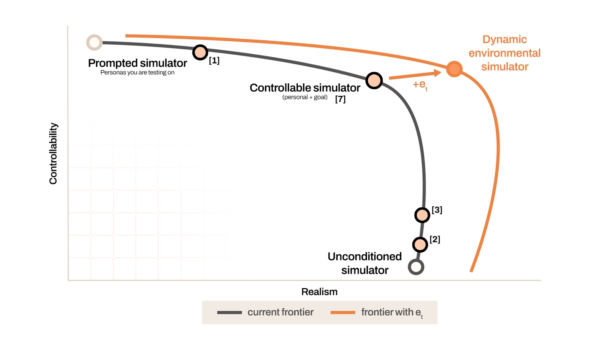
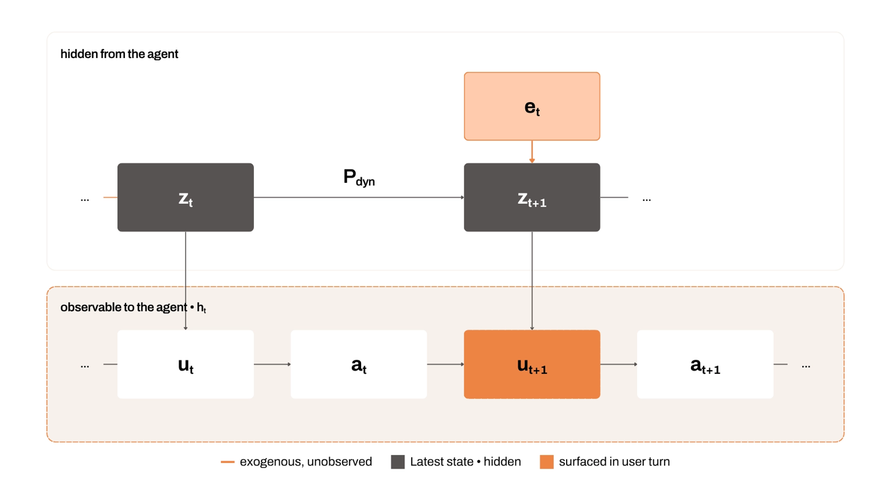

# The User Went for a Cigarette

*Modeling Partial Observability for High-Fidelity User Simulation*

---



*Introducing exogenous environmental influences into simulated user behavior*

## Controllability vs. Realism in User Simulation

Everyone building user simulators wants two things at once: a stand-in that does exactly what it's told, and one that behaves like a real human - who notoriously will not. Controllability and realism pull in opposite directions, and buying more of one tends to cost you the other. High-realism approaches, such as fine-tuned models which simulate user turns in multi-turn user-agent conversations [1], can't be steered toward specific evaluation scenarios. At the controllability end of the spectrum, simulations treat the user as **goal-stable** by assigning them fixed personas, traits, or objectives, enabling systematic evaluation of agents in bounded user-in-the-loop environments [2, 3].

In common terms, a length T trajectory

```math
\tau = (u_1, a_1, \ldots, u_T, a_T)
```

consists of user turns *uᵢ* and corresponding agent turns *aᵢ*. At a given time step *t*, we call

```math
h_t = (u_1, a_1, \ldots, u_t, a_t)
```

the observable history of the trajectory through time step *t*. The goal of a user simulator is to produce a user turn at time step *t*, which follows some probability distribution

```math
u_t \sim P(\cdot \mid h_{t-1}, z),
```

where *z* is the user simulation latent state. In recent controllable user simulation work, *z* has taken many forms — most prominently *personas*, which bundle stable user attributes such as expertise with behavioral dispositions into a fixed profile that conditions how the user should respond [3, 4, 5]. Another common formulation is a *goal*: a fixed objective and success criterion the user works toward [3, 6].

This formulation treats *z* as static, which is an assumption frequently broken by real users. For example, consider a user simulator assigned the trait "naive" performing a coding task. When the agent produces a quality explanation of the coding task for the user, a faithful user simulator would react by becoming slightly less naive, having gleaned some level of new understanding from the explanation. A simulator that conditions on a fixed *z*, however, remains naive at every time step. This is a failure mode where the simulator fails to *look behind* — to let what already happened in the conversation revise the user's state.

A fixed *z* simulator also fails in a second, opposite direction. Because the label is set once and held constant, it can also bake in bias toward events that haven't happened yet. Borrowing an example from Tennenholtz et al. [7], consider a simulator conditioned on the trajectory-level outcome label "frustrated." A simulated frustrated user will produce frustrated turns from the very first message, even against a flawless agent that gave the user nothing to be frustrated about. Here, the simulator (impossibly) *looks ahead* — the user state encodes where it thinks the trajectory will end, before it actually gets there.

Recent work thus treats *z* as a latent state that evolves over the course of the interaction [6, 8]. Rather than fixing the user persona or goal once, the next state is explicitly sampled from a distribution over the user dynamics

```math
z_t \sim P_{dyn}(\cdot \mid h_{t-1}, z_{t-1}),
```

so that the explanation to the naive user carries the state toward a more informed one. Each user response is then drawn given the current state

```math
u_t \sim P_{resp}(\cdot \mid h_{t-1}, z_t).
```

In this revised formulation the user state can be influenced by the conversation history — agent messages and its own prior responses. A more sophisticated simulation might also include *shared environment updates* as part of each step [9, 10], such as updates to code files in a working repository or edited cells in a shared excel sheet.

However, even this revised formulation leaves out a crucial factor. Conversation history and shared workspaces are both fully observable by the agent, and both can easily be loaded into context. The problem is that much of what actually moves a real user is *invisible* to the agent. *What does the agent miss when the user goes for a cigarette?*

---

## Modeling Exogenous Environmental Factors



*We model exogenous influences on user state transitions using an environmental variable eₜ*

At Collinear, we regularly work on new RL training pipelines. Recently a junior researcher worked with Claude Code to develop a GRPO configuration for evaluating the learning signal from a particular simulated environment. The researcher instructed their agent to smoke test this configuration with several tasks and a small number of attempts for each one, and told the agent to kick off training runs accordingly. Frustrated by the endless cycle of environment bug-squashing that followed, the junior researcher left their Claude Code session and went to a senior researcher, who suggested a simple fix; pick a single task that was bug-free and crank up the config's group size to isolate infrastructure issues from task quality.

From the agent's perspective, this conversation between coworkers was *exogenous* — it happened outside the shared environment between the junior researcher and the agent [11]. It was also unobservable, at least until the junior researcher sat back down to summarize and revise their instructions. Yet this conversation forced a total pivot in direction onto the agent.

Conversations with coworkers, reading blog posts, falling asleep and forgetting everything you worked on yesterday, revelations from a midday walk — these environmental factors are critical in a real user's workflow. To model these exogenous, environmental factors, we propose a simple addition to the dynamic state transition step:

```math
z_{t+1} \sim P_{dyn}(\cdot \mid h_t, z_t, e_t),
```

where *eₜ* is an exogenous environmental variable. In our example, *eₜ* is the hallway conversation leading to the senior researcher's suggestion. It never directly enters *hₜ*, yet it moves the user's state *zₜ₊₁*, which surfaces on the next turn *uₜ₊₁* as a redirected instruction the agent has to absorb.

Importantly, by isolating *eₜ* we can study the effects of injecting different pieces of environmental information to user simulators. We can measure the effects of these "context switches" by fixing user simulators with an initial state, assigned goal, persona, or any other formulation of *z₀* and varying these environmental updates. Control over *eₜ* ultimately enables measurement of agent behavior for users in diverse environments.

---

## What Can eₜ Teach Us?

Finally, suppose we have such a fair user simulator, conditioned on a specified *eₜ* — so what? In our internal example, what do we want Claude Code to do? One argument says that this exogenous variable is irrelevant to the agent, since it followed the junior researcher's initial instructions, then (presumably) followed their updated instructions after the fact. However, we'd argue that this exemplifies a gap between instruction-following and genuine helpfulness for this junior researcher. In our opinion (one shared by our CFO), Claude Code should have suggested that the junior researcher structure their GRPO smoke tests in that way *before* wasting time and tokens on a broken approach. If the negative effect of this context switch had been measured during evaluation, in a simulated environment, perhaps our junior researcher could have been spared the headache.

Modeling exogenous, agent-unobservable perturbations to the user's environment will allow us to answer questions including, but not limited to, the following.

1. *How should agents detect that an unobserved shift has occurred?* By construction, *eₜ* is invisible to the agent — it's only evidence is the user's behavior. In our example, the junior researcher returns with an instruction that doesn't follow from *hₜ₋₁*. Can an agent learn to read a sudden redirection as a signal that something changed off-screen, rather than treating each new turn as a continuation of the prior plan?
2. *How should agents adapt once they detect a shift?* This is where it pays off to separate *eₜ* from the rest of trajectory. The change was exogenous, so the agent should not read it as evidence of its own failure, yet it still has to act on it: let go of a now-stale, prior goal without discarding still useful context. (The conversation between the junior and senior researchers led to a total reasoning overhaul in the session.) In our experience, agents tend to over-index on prior instructions, and resist to steering after a true change of direction.
3. *How should an agent anticipate a user's needs (and preempt them)?* In our example, Claude Code could have asked the junior researcher about the run's intended batch size and simplified the configuration *before* the hallway conversation ever happened. Can we teach agents to spot likely problems in a workflow and raise them early? Recent work has evaluated behavior in response to underspecification [12]. Explicitly modeling exogenous signals allows us to specify the shape of underspecification (and other suboptimal human user behavior) during a trajectory, stress-testing agents in a variety of realistic scenarios.
4. *How do agents react to large lapses in time between user turns?* Recent work has pointed out that agents are often "temporally blind", leading to worse performance on time-sensitive tasks [10]. Time lapse can be considered a one-variable special case of this exogenous environmental variable for user simulation.

And finally, the biggest open question: *How do we know the simulator is realistic and fair?* Every question above rests on this. A simulator whose reaction to an injected *eₜ* drifts from what a real person would do is making up a person — evaluating the agent against a ghost [13]. Every reward you compute using that user simulator is a number about nobody. Pinning down the right user reaction, and figuring out how to score agents against it, are the problems we are most excited to work on at Collinear. If this is what keeps you up at night, come find us.

---

## Citations

[1] Naous, Tarek, et al. "Flipping the dialogue: Training and evaluating user language models." *arXiv preprint arXiv:2510.06552* (2025).

[2] Barres, Victor, et al. "τ²-Bench: Evaluating Conversational Agents in a Dual-Control Environment." *arXiv preprint arXiv:2506.07982* (2025).

[3] Zhou, Xuhui, et al. "OdysSim: Building Foundation Models for Human Behavior Simulation." *arXiv preprint arXiv:2606.14199* (2026).

[4] Castricato, Louis, et al. "Persona: A reproducible testbed for pluralistic alignment." *Proceedings of the 31st International Conference on Computational Linguistics*. 2025.

[5] [https://matraix.ai/blog/application-colm.html](https://matraix.ai/blog/application-colm.html)

[6] He, Muyu, et al. "Impatient users confuse ai agents: High-fidelity simulations of human traits for testing agents." *Proceedings of the 64th Annual Meeting of the Association for Computational Linguistics (Volume 1: Long Papers)*. 2026.

[7] Tennenholtz, Guy, et al. "Controllable User Simulation." *arXiv preprint arXiv:2605.11519* (2026).

[8] Zhou, Xuhui, et al. "Tom-swe: User mental modeling for software engineering agents." *arXiv preprint arXiv:2510.21903* (2025).

[9] Raghavendra, Mohit et al. "SWE-INTERACT: Reimagining SWE Benchmarks as User-Driven Long-Horizon Coding Sessions." (2026).

[10] Wu, Yifan et al. "SWE-Together: Evaluating Coding Agents in Interactive User Sessions." (2026).

[11] Jaya Gupta (@JayaGup10), [post on X](https://x.com/JayaGup10/status/2003525933534179480), Dec 23, 2025.

[12] Pu, George, et al. "LHAW: Controllable Underspecification for Long-Horizon Tasks." *ICLR 2026 Workshop on Lifelong Agents: Learning, Aligning, Evolving*.

[13] Zhou, Xuhui, et al. "Mind the sim2real gap in user simulation for agentic tasks." *arXiv preprint arXiv:2603.11245* (2026).

---

*Originally published on [Collinear AI's Blog](https://blog.collinear.ai/p/the-user-went-for-a-cigarette).*
